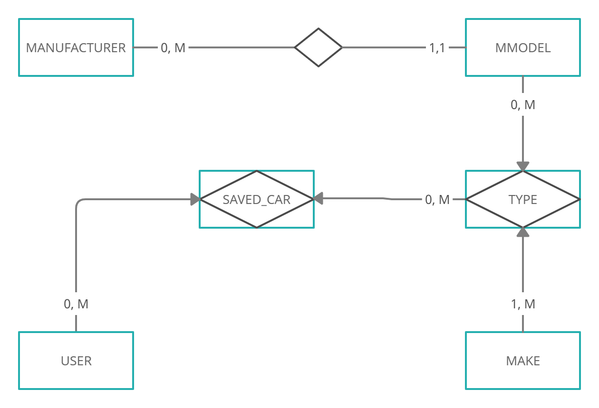

# MSAIP  

User manual for installing and starting the application

## Installing project

### Prerequisites:

- Installed [GIT CLI](https://git-scm.com/)
- Installed [Composer](https://getcomposer.org/download/)  
- Installed [NodeJS](https://nodejs.org/en/download/)  
- Installed [MySQL](https://www.apachefriends.org/index.html)

---

We are going to clone repo with command

```bash
git clone https://github.com/GaGiiiii/msaip/
```

We then open two terminals, and then in 1st type:

```bash
cd msaip
cd msaip-back
composer i
```

In the 2nd terminal we type:

```bash
cd msaip
cd msaip-front
npm i
```

With the commands above we have installed all the dependencies located in the composer.json and package.json files

---

## Starting project

### Database config

Before we start our application we will need to create local DBs with names 'msaip' and 'msaip_test'  
Then in 'msaip' we can import data from SQL file that is located inside 'msaip-back' directory called 'msaip.sql'  
We don't need to insert data into testing DB.

### Starting backend

We are going to start backend from "msaip-back" directory with command:

```bash
php artisan serve
```

### Starting frontend

We are going to start frontend from "msaip-front" directory with command:

```bash
npm start
```
Application is listening for any changes in code and after every chnage app will restart automatically.

Backend works on [localhost:8000](http://localhost:8000/)   
Frontend works on [localhost:3000](http://localhost:3000/)  

## Starting Tests

For tests to execute we need to enter next command inside our 'msaip-back' directory:

```bash
php artisan test
```

## Documentation

### Below is the ER Model



### Relation Model:  

---  
User(**id**, username, email, email_verified_at, password, remember_token, created_at, updated_at)  
Manufacturer(**id**, name, created_at, updated_at)  
M_Model(**id**, *manufacturer_id*, name, created_at, updated_at)  
Type(**id**, ***m_model_id, make_id***, created_at, updated_at)  
Make(**id**, name, created_at, updated_at)  
Saved_Car(**id**, ***user_id, type_id***, created_at, updated_at)

---

## API Documentation  

---

### AUTH

--- 

#### Register

```http
POST /api/register
```

| Parameter | Type     | Description                |
| :-------- | :------- | :------------------------- |
| `first_name` | `string` | **Required** Provided first name. |
| `last_name` | `string` | **Required** Provided last name. |
| `email` | `string` | **Required** Provided email. |
| `password` | `string \| min 4 chars` | **Required** Provided password. |
| `password_confirmation` | `string` | **Required** Confirmed password. |
| `image` | `file \| image \| max 5mb ` | **Required** Users profile picture. |
| `interests` | `string` | In format: **1,3,5**. Where 1,3,5 are **ID's** of categories. |

#### Login

```http
POST /api/login
```

| Parameter | Type     | Description                |
| :-------- | :------- | :------------------------- |
| `email` | `string` | **Required** Provided email. |
| `password` | `string \| min 4 chars` | **Required** Provided password. |

#### Logout

```http
POST /api/logout
```

| Parameter | Type     | Description                |
| :-------- | :------- | :------------------------- |
| `token` | `string` | **Required** Users token. |

---

### POSTS

---

#### Get all posts

```http
GET /api/posts
```

| Parameter | Type     | Description                |
| :-------- | :------- | :------------------------- |
| `sortBy` | `string` | **Optional** Available options **dateDesc \| dateAsc \| popularity** |
| `categories` | `string` | **Optional** In format: **1,3,5** where 1,3,5 are **ID's** of categories |
| `search` | `string` | **Optional** First name / Last name of user who created post |

#### Add new post

```http
POST /api/posts
```

| Parameter | Type     | Description                       |
| :-------- | :------- | :-------------------------------- |
| `category_id` | `integer` | **Required** ID of category to which post belongs to. |
| `title` | `string \| min 10, max 100 chars` | **Required**. Title of the post. |
| `body` | `string \| min 10 \| max 10000 chars` | **Required** (if no image / video provided). |
| `image` | `file \| image \| max 5mb` | **Required** (if no body / video provided). |
| `video` | `file \| video \| max 20mb` | **Required** (if no body / image provided). |
| `token` | `string` | **Required** Users token. |

#### Update post

```http
PUT /api/posts/${id}
```

| Parameter | Type     | Description                       |
| :-------- | :------- | :-------------------------------- |
| `id` | `integer` | **Required** ID of post intended to update. |
| `category_id` | `integer` | **Required** ID of category to which post belongs to. |
| `title` | `string \| min 10, max 100 chars` | **Required** Title of the post. |
| `body` | `string \| min 10 \| max 10000 chars` | **Required** (if no image / video provided). |
| `image` | `file \| image \| max 5mb` | **Required** (if no body / video provided). |
| `video` | `file \| video \| max 20mb` | **Required** (if no body / image provided). |
| `token` | `string` | **Required** Users token. |

#### Delete post

```http
DELETE /api/posts/${id}
```

| Parameter | Type     | Description                       |
| :-------- | :------- | :-------------------------------- |
| `id` | `integer` | **Required** ID of post intended to delete. |
| `token` | `string` | **Required** Users token. |

---

### Comments

---

#### Get all comments

```http
GET /api/comments
```

#### Add new comment

```http
POST /api/comments
```

| Parameter | Type     | Description                       |
| :-------- | :------- | :-------------------------------- |
| `post_id` | `integer` | **Required** ID of post to which comments belongs to. |
| `body` | `string \| min 20 \| max 5000 chars` | **Required** |
| `token` | `string` | **Required** Users token. |

#### Update comment

```http
PUT /api/comments/${id}
```

| Parameter | Type     | Description                       |
| :-------- | :------- | :-------------------------------- |
| `id` | `integer` | **Required** ID of comment intended to update. |
| `post_id` | `integer` | **Required** Id of post to which comments belongs to. |
| `body` | `string \| min 20 \| max 5000 chars` | **Required** |
| `token` | `string` | **Required** Users token. |

#### Delete comment

```http
DELETE /api/comments/${id}
```

| Parameter | Type     | Description                       |
| :-------- | :------- | :-------------------------------- |
| `id` | `integer` | **Required** ID of comment intended to delete. |
| `token` | `string` | **Required** Users token. |

---

### Likes

---

#### Add new like

```http
POST /api/likes
```

| Parameter | Type     | Description                       |
| :-------- | :------- | :-------------------------------- |
| `post_id` | `integer` | **Required** ID of post to which like belongs to. |
| `token` | `string` | **Required** Users token. |

#### Delete like

```http
DELETE /api/likes/${id}
```

| Parameter | Type     | Description                       |
| :-------- | :------- | :-------------------------------- |
| `id` | `integer` | **Required** ID of like intended to delete. |
| `token` | `string` | **Required** Users token. |

---

#### Most popular posts in category

```http
GET /api/categories/${id}/most-popular-posts
```

| Parameter | Type     | Description                       |
| :-------- | :------- | :-------------------------------- |
| `id` | `integer` | **Required** ID of selected category. |

#### Users points

```http
GET /api/users/${id}/points
```

| Parameter | Type     | Description                       |
| :-------- | :------- | :-------------------------------- |
| `id` | `integer` | **Required** ID of selected user. |


## Responses

API returns a JSON response in the following format:

```javascript
{
  "message": string,
  "data": data,
  "errors?": array,
  "token?": string,
}
```
The `message` - attribute contains a message commonly used to indicate errors or, in the case of deleting a resource, success that the resource was properly deleted.

The `data` - attribute contains requested resource/s or processed resource. Eg. if we requsted to get all posts the data attr will look like this `"posts": array of posts`.  

The `errors` - attribute is optional and it contains error messages.

The `token` - attribute is optional and it will be returned when user logins or registers.

## Status Codes

API returns the following status codes:

| Status Code | Description |
| :--- | :--- |
| 200 | `OK` |
| 201 | `CREATED` |
| 400 | `BAD REQUEST` |
| 404 | `NOT FOUND` |
| 500 | `INTERNAL SERVER ERROR` |


